# Build An On-Device Surgical Logistics Agent On Qualcomm Dragonwing IQ-9075 EVK

**Author:** [Eivind Holt](https://www.linkedin.com/in/eivholt/), July 2026  

**Repository:** [github.com/eivholt/or-edge-agent](https://github.com/eivholt/or-edge-agent)  

**Target:** [Qualcomm Dragonwing IQ-9075 EVK / QCS9075 / Hexagon v73](https://www.qualcomm.com/developer/hardware/qualcomm-iq-9075-evaluation-kit-evk). Hardware generously sponsored by Qualcomm

**Model:** [mistralai/Ministral-3-3B-Instruct-2512](https://huggingface.co/mistralai/Ministral-3-3B-Instruct-2512) Q4_K_M GGUF running on device NPU

This tutorial shows how to build and run a complete agentic
application on a Qualcomm IQ9 IQ9075 evaluation kit, complete with a visual dashboard. The application is a
synthetic operating-room logistics demo: it observes a room prepared for
surgery, compares the instruments it can see with a synthetic case record, and
requests supply orders or human tasks when an instrument may
be outside the sterile work area.

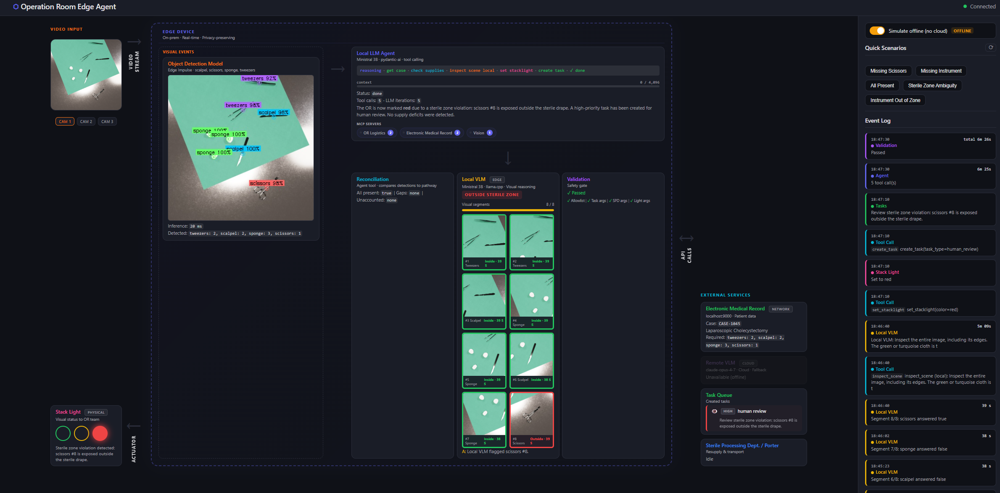

Demo (YouTube):

[](https://www.youtube.com/watch?v=231SRW_yUvY)

The **sterile drape** is the green covering
that defines a clean work surface next to a patient in surgery. An instrument beyond its
boundary may need a person to review the scene. The **electronic medical
record** in this demo is a local synthetic service that supplies the expected
instrument list. The application demonstrates logistics workflow, using the correct tools/APIs with correct parameters, reasoning on results and acting accordingly.

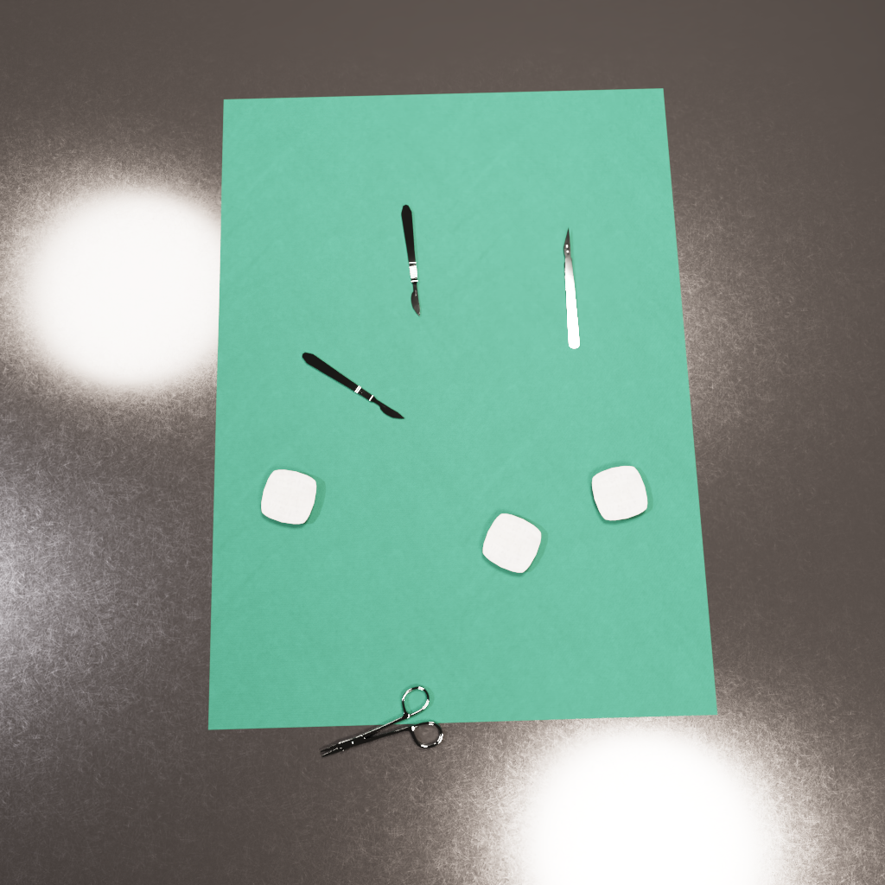

The architecture highlights three reusable edge-agent patterns:

1. **Object detection triggers agent.** An Edge Impulse FOMO model detects and
  counts instruments before triggering the LLM-agent, supplying detected objects.
2. **Use separate models for decisions and vision.** A local Ministral language
  model decides which tools the agent should call. A vision model then examines
  either small image regions around detected instruments or the complete image.
  The vision model can run locally or in the cloud. The detector only chooses
  which regions to inspect; it does not decide whether an instrument is outside
  the sterile area. Application logic applies the final workflow rules.
3. **A visual, on-device execution trace.** The dashboard shows the input image,
   detector results, case-record lookup, supply comparison, visual inspection,
   tool actions, and final status light, emulating a physical industrial stack light, as the workflow runs on the device.

The sections below start with the official Ministral model GGUF on an x86-64 Ubuntu workstation,
compile it into Qualcomm AI Runtime context binaries, copy the export and its
matching runtime to the evaluation kit, and build the service that keeps the
model loaded. They then assemble the application and verify the full
detector-to-agent flow.

Versions used as of July 2026:

- Ubuntu AArch64, kernel `6.8.0-1077-qcom`
- Python `3.12.3`
- Qualcomm AI Runtime `2.47.0.260601`, IQ9075, Hexagon v73
- Ministral 3B Q4 text model on the Qualcomm Hexagon Tensor Processor
- Ministral 3B Q4 decoder plus official BF16 vision projector on CPU
- Edge Impulse float32 AArch64 runner

## Glossary

- **BF16 (bfloat16):** A 16-bit floating-point format commonly used for neural
  network inference. Here, the vision projector remains BF16 while the language
  model is quantized more aggressively.
- **Context binary:** A compiled, serialized QNN model graph that the target
  device can load without recompiling the network. This tutorial produces two
  context binaries because the language model is split into two partitions.
- **EVK (evaluation kit):** A development board for evaluating a processor
  before integrating it into a product. The target here is the Qualcomm
  Dragonwing IQ-9075 EVK.
- **FOMO (Faster Objects, More Objects):** Edge Impulse's lightweight object
  detector. It predicts object classes and centroids on a grid, which is enough
  for this application to count instruments and select image regions.
- **Genie:** Qualcomm's generative-AI runtime and API for executing language
  models compiled for Qualcomm hardware.
- **GGUF:** A portable model-file format used by inference engines such as
  `llama.cpp`. It packages model tensors and metadata; it is the source artifact
  that QAIRT compiles for the IQ9075 in this tutorial.
- **HTP (Hexagon Tensor Processor):** The neural-network accelerator within the
  Qualcomm Hexagon processor. The exported text model runs on this accelerator.
- **Multimodal projector:** A small learned component that maps features from a
  vision encoder into embeddings the language model can consume. The projector
  must match the language model release.
- **NPU (neural processing unit):** A processor specialized for neural-network
  operations. HTP is the Qualcomm accelerator used as the NPU in this setup.
- **Q4_K_M:** A GGUF quantization scheme that stores most model weights at about
  four bits while retaining selected tensors at higher precision. It reduces
  memory and compute requirements at some cost to numerical fidelity.
- **QAIRT (Qualcomm AI Runtime):** Qualcomm's toolkit and runtime for converting,
  compiling, and executing AI models on Qualcomm processors.
- **QNN (Qualcomm Neural Network):** The graph and backend API within QAIRT. The
  exporter targets the `QnnHtp` backend and produces QNN context binaries.
- **Quantization:** Representing model weights with fewer bits than conventional
  floating point to reduce model size, memory bandwidth, and inference cost.
- **VLM (vision-language model):** A model that accepts both images and text.
  This application uses Ministral with its vision projector to inspect image
  segments selected by the detector.

## Combining object detection with Visual Language Model
An object detection model can efficiently classify and image and count the number of instances of objects of interest. However, it can't reason over placement of the objects. In this demo VLMs are used to further answer whether the detected objects are placed in a sterile zone, or if they have been moved to a potentially contaminated area and need to be replaced. The VLMs are only used if any objects are detected, the agent makes this decision based on object detection model output and available tools.

## Why Visual Inspection Can Run Locally Or Remotely

The first version used one local multimodal Ministral model for visual
inspection. On a workstation with an RTX 5090, the BF16 model processed the
entire image in about 0.46 seconds and correctly identified the known
out-of-zone instrument. This made full-frame local inference the simplest
design: send one image to the VLM and let it inspect the complete scene.

Moving that same idea to the IQ9075 evaluation kit exposed two problems. The
Q4 decoder and BF16 projector run through `llama.cpp` on the kit's CPU rather
than through the HTP text-model path. Full-frame requests took 446 seconds at
1024 visual tokens and 945 seconds at 2048 visual tokens, and both still missed
the known positive scene. The small local model was therefore both too slow and
too unreliable for this spatial judgment on the evaluation kit.

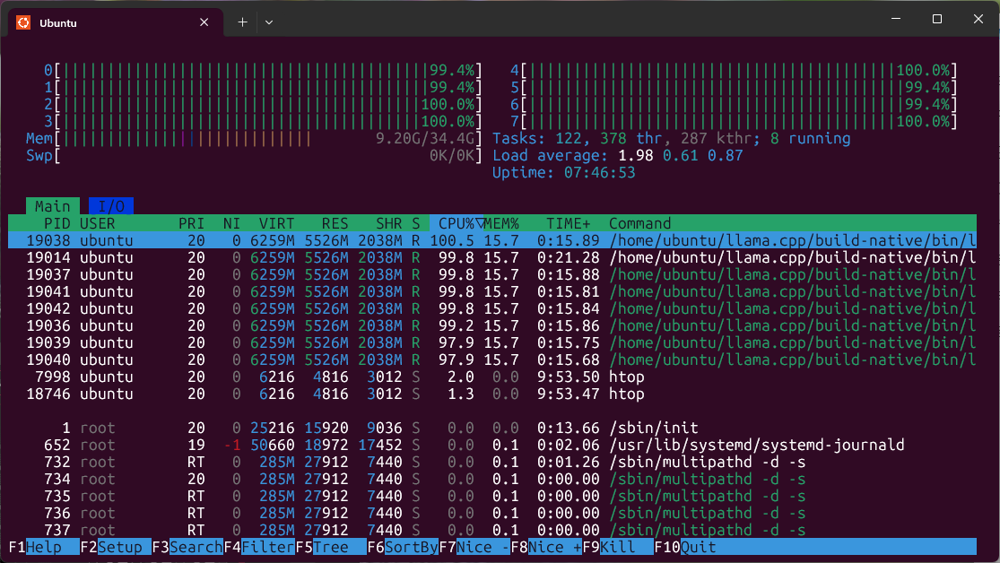

The next attempt used the fast FOMO detector as a visual gate. Instead of asking the VLM
to search the entire frame, the application creates a square crop around each
detected instrument's centroid, preserving enough of the surrounding surface
to show whether that instrument is on the green drape or if any part is outside. Each
crop receives a constrained boolean question, and the scene is positive when
any crop is positive. This is a reusable edge pattern: use a small detector to
find relevant regions, then spend VLM compute only on those regions. Detector
geometry selects the input candidate; it never decides the sterile-zone verdict.

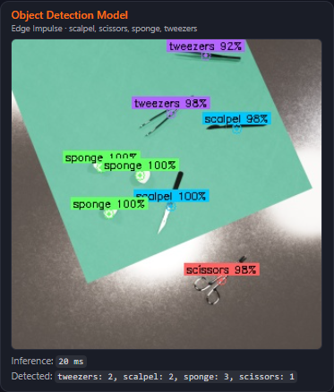 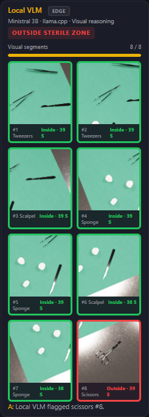

The crop experiment demonstrated that the extra local detail can recover the
needed decisions, but not at a practical speed. At 64 visual tokens, all 42
crops across five scenarios completed in 27 minutes, but only two scenarios
were correct. The complete 256-token run corrected those three failures but
introduced a false positive in test case `all_present`, finishing **4/5 cases correct**.
Its 42 serial crops took 4,895 seconds (81 minutes 35 seconds), or about 14-21
minutes per case. Slicing can supply more useful visual evidence, but this local
implementation remains too slow and inconsistent for an operational workflow.

Local VLM demo (YouTube):

[](https://www.youtube.com/watch?v=mv9Yxe_LFpQ)

For that reason, the application now supports a cloud VLM for visual inspection.
The dashboard's cloud option sends the full image and the same fixed question to
the configured Azure VLM, while the text/tool agent remains local on the HTP.
With cloud mode off, the detector-centered local experiment remains available
for reproducibility, offline evaluation, and dashboard demonstrations. Cloud
mode is an engineering fallback, not a requirement of the architecture: it can
be replaced by a more capable VLM on a workstation or another edge server,
provided the visual-inspection adapter sends the image and returns the same
boolean verdict contract. The later performance section records the complete
measurements and their limitations.

## Prepare The Export Workstation

Model compilation runs on an x86-64 Ubuntu workstation, not on the evaluation
kit. The validated host used Ubuntu 22.04 under WSL2, QAIRT DEV `0.8.1`, and
Qualcomm AI Runtime `2.47.0.260601`. Reserve 45-50 GB of fast Linux storage:
the 2.15 GB GGUF expands into a 30 GB build cache, a 3.3 GB saved container, and
a 3.3 GB deployable Genie export. The validated export took about 25 minutes.

Install Miniconda if `conda` is not already available, then clone this
repository in the workstation's Linux filesystem:

```bash
git clone https://github.com/eivholt/or-edge-agent.git "$HOME/or-edge-agent"
cd "$HOME/or-edge-agent"

source "$HOME/miniconda3/etc/profile.d/conda.sh"
conda create -y -n qairt-dev-gguf \
  python=3.12 cmake make clang clangxx llvmdev \
  libcxx libcxxabi libunwind flatbuffers
conda activate qairt-dev-gguf
python -m pip install "qairt-dev==0.8.1" "huggingface_hub[cli]==0.36.2"
```

`qairt-dev` is distributed through Qualcomm's package channel and requires
the access credentials associated with the Qualcomm developer account. Let its
version manager install the host dependencies and fetch the exact SDK:

```bash
qairt-vm -y -f
mkdir -p "$HOME/qairt_sdks/qairt"
qairt-vm fetch -v 2.47.0 -d "$HOME/qairt_sdks/qairt"

export QAIRT_SDK_ROOT="$HOME/qairt_sdks/qairt/2.47.0.260601"
export PATH="$QAIRT_SDK_ROOT/bin/x86_64-linux-clang:$PATH"
export LD_LIBRARY_PATH="$QAIRT_SDK_ROOT/lib/x86_64-linux-clang:${LD_LIBRARY_PATH:-}"
qairt-vm -i
```

If `qairt-vm` prints a different build suffix for 2.47, use that directory in
every command below. Do not source the SDK's complete `envsetup.sh` in this
Conda environment: it can put a second `qairt` Python package ahead of QAIRT
DEV. The three explicit exports provide the required host tools and libraries.

## Download And Export Ministral

Download Mistral's official Q4_K_M file. QAIRT consumes the existing weight
quantization, constructs the IQ9075 graph, splits it into two partitions, and
compiles both partitions into HTP context binaries.

```bash
mkdir -p "$HOME/models/ministral3_3b"
hf download \
  mistralai/Ministral-3-3B-Instruct-2512-GGUF \
  Ministral-3-3B-Instruct-2512-Q4_K_M.gguf \
  --local-dir "$HOME/models/ministral3_3b"

sha256sum \
  "$HOME/models/ministral3_3b/Ministral-3-3B-Instruct-2512-Q4_K_M.gguf"
```

The validated GGUF SHA-256 is:

```text
9ed150d4367e68df0ac8e1540f6ddc65b42d0ee26378329d1ecbca60f93fc5f8
```

Run the repository exporter from the active QAIRT environment:

```bash
cd "$HOME/or-edge-agent"
mkdir -p logs

/usr/bin/time -v \
  python scripts/export_ministral3_3b_iq9075_gguf.py \
    --gguf "$HOME/models/ministral3_3b/Ministral-3-3B-Instruct-2512-Q4_K_M.gguf" \
    --build-root "$HOME/qairt_build/ministral3_3b_q4" \
  2>&1 | tee logs/ministral3_3b_q4_export.log
```

The helper selects `dsp_arch:v73;soc_model:77;cores:1`, the explicit QAIRT
target for the IQ9075, and requests two QNN context binaries. It saves the
intermediate `LLMContainer` under `container/` and calls
`LLMContainer.export()` to write the deployable package under `genie/`.
Successful output ends with `EXPORT_SUMMARY=`. The final directory contains:

```text
~/qairt_build/ministral3_3b_q4/genie/
|-- genie_config.json
`-- artifacts/
    |-- split_model_1.bin
    |-- split_model_2.bin
    |-- tokenizer.json
    `-- tmp*.json
```

Confirm that the generated config names `QnnHtp`, both context binaries are
substantial files, and no partial output was mistaken for an export:

```bash
GENIE="$HOME/qairt_build/ministral3_3b_q4/genie"
python -m json.tool "$GENIE/genie_config.json" >/dev/null
grep -q QnnHtp "$GENIE/genie_config.json"
test "$(stat -c %s "$GENIE/artifacts/split_model_1.bin")" -gt 1000000000
test "$(stat -c %s "$GENIE/artifacts/split_model_2.bin")" -gt 1000000000
du -sh "$GENIE"
```

## Install The Matching Runtime On The Evaluation Kit

Keep QAIRT 2.47 beside the kit's factory runtime instead of replacing
`/opt/qairt/current`. A model compiled by 2.47 failed during context creation
when loaded with the default 2.45 runtime.

On the workstation, set the evaluation-kit address and create the destination:

```bash
EVK=ubuntu@<device-ip>
QAIRT_DEVICE_ROOT=/home/ubuntu/qairt-2.47.0.260601
TARGET=aarch64-oe-linux-gcc11.2

ssh "$EVK" "mkdir -p \
  $QAIRT_DEVICE_ROOT/bin/$TARGET \
  $QAIRT_DEVICE_ROOT/lib/$TARGET \
  $QAIRT_DEVICE_ROOT/lib/hexagon-v73/unsigned"
```

Copy the target executables, AArch64 libraries, and Hexagon v73 libraries from
the same SDK that performed the export:

```bash
rsync -ah --info=progress2 \
  "$QAIRT_SDK_ROOT/bin/$TARGET/" \
  "$EVK:$QAIRT_DEVICE_ROOT/bin/$TARGET/"
rsync -ah --info=progress2 \
  "$QAIRT_SDK_ROOT/lib/$TARGET/" \
  "$EVK:$QAIRT_DEVICE_ROOT/lib/$TARGET/"
rsync -ah --info=progress2 \
  "$QAIRT_SDK_ROOT/lib/hexagon-v73/unsigned/" \
  "$EVK:$QAIRT_DEVICE_ROOT/lib/hexagon-v73/unsigned/"
```

Transfer the exported model:

```bash
rsync -ah --info=progress2 \
  "$HOME/qairt_build/ministral3_3b_q4/genie/" \
  "$EVK:~/ministral_q4_genie_export/"
```

## Prepare The Bundle On The Evaluation Kit

Open an evaluation-kit shell, clone the repository without downloading its
Git LFS detector binaries yet, and create the deterministic agent
configuration:

```bash
ssh "$EVK"
sudo apt-get update
sudo apt-get install -y git
GIT_LFS_SKIP_SMUDGE=1 git clone \
  https://github.com/eivholt/or-edge-agent.git "$HOME/or-edge-agent"
cd "$HOME/or-edge-agent"
python3 scripts/prepare_genie_bundle.py "$HOME/ministral_q4_genie_export"
```

This preserves the original export and writes `genie_config.agent.json` with
seed 42, temperature 0, top-k 1, and top-p 1. It also writes the C++ service's
identity `prompt.json` and root-level relative links to artifacts that the
sample service resolves by basename.

Verify every runtime and model input before compiling the server:

```bash
QAIRT_ROOT="$HOME/qairt-2.47.0.260601"
TARGET=aarch64-oe-linux-gcc11.2
BUNDLE="$HOME/ministral_q4_genie_export"

test -x "$QAIRT_ROOT/bin/$TARGET/genie-t2t-run"
test -f "$QAIRT_ROOT/lib/$TARGET/libQnnHtp.so"
test -f "$QAIRT_ROOT/lib/hexagon-v73/unsigned/libQnnHtpV73Skel.so"
test -f "$BUNDLE/genie_config.agent.json"
test -L "$BUNDLE/split_model_1.bin"
test -L "$BUNDLE/split_model_2.bin"
```

## Build The Persistent Genie Service

The application uses Qualcomm's open-source `GenieAPIService` to load the two
contexts once and keep them resident between agent turns. Build the validated
source revision directly on the evaluation kit:

```bash
sudo apt-get update
sudo apt-get install -y build-essential cmake git

mkdir -p "$HOME/src"
git clone --recurse-submodules \
  https://github.com/qualcomm/qai-appbuilder.git \
  "$HOME/src/qai-appbuilder-full"
cd "$HOME/src/qai-appbuilder-full"
git checkout 86ce07addc4404a026a5fdb17787ca804a8221d4
git submodule update --init --recursive
git apply "$HOME/or-edge-agent/scripts/qai_appbuilder_86ce07a_iq9.patch"

export QNN_SDK_ROOT=/opt/qairt/current
SERVICE_SRC="$HOME/src/qai-appbuilder-full/samples/genie/c++/Service"
cmake -S "$SERVICE_SRC" -B "$SERVICE_SRC/build_linux" \
  -DCMAKE_BUILD_TYPE=Release
cmake --build "$SERVICE_SRC/build_linux" -j2
```

The pinned source needs its recursive submodules for headers such as
`CLI/CLI.hpp`. The repository patch fixes one GCC 13 qualification error and
binds the service to loopback; it does not alter inference or tool parsing.
Keep `QNN_SDK_ROOT` set for both CMake commands. Compilation uses the kit's
installed development headers, while the launch script selects the side-by-side
2.47 runtime that matches the model.

Locate the resulting service and verify it is executable:

```bash
SERVICE_BIN="$SERVICE_SRC/GenieService_v2.1.5_qnnunknown/GenieAPIService"
test -x "$SERVICE_BIN"
```

## Install The Application

Install Git Large File Storage because both detector runners are stored as
large-file objects. The bundle-preparation steps deferred those downloads so
the service patch was available before the application environment had to be
installed; fetch the model binaries now.

```bash
sudo apt update
sudo apt install -y git git-lfs python3.12-venv
git lfs install

cd "$HOME/or-edge-agent"
git lfs pull

python3 -m venv .venv
.venv/bin/python -m pip install --upgrade pip
.venv/bin/python -m pip install -e '.[test]'
```

Verify that the ARM detector is a binary, not a Git LFS pointer:

```bash
file models/modelfile.aarch64.eim
sha256sum models/modelfile.aarch64.eim
```

The validated SHA-256 is:

```text
90b5809422276b14db3ba0c47ecc3061bbb4b76c78b7ac0d093ca182b2ac0238
```

### Alternative: Download The Detector With The Edge Impulse CLI

Instead of taking the detector runner from this repository, build and download
it from the public Edge Impulse project:

1. Sign in to Edge Impulse and open
  [Surgery Inventory Synthetic NVIDIA](https://studio.edgeimpulse.com/public/371734/latest).
2. Select **Clone this project**. The Linux runner can authenticate against a
  project in your account; cloning preserves the public project's impulse and
  trained model while giving you permission to build a deployment.
3. On the evaluation kit, install the Edge Impulse Linux CLI in a user-owned npm
  prefix:

```bash
sudo apt update
sudo apt install -y nodejs npm gcc g++ make
node --version  # Must be v16 or newer.

mkdir -p "$HOME/.npm-global"
npm config set prefix "$HOME/.npm-global"
export PATH="$HOME/.npm-global/bin:$PATH"
printf '\nexport PATH="$HOME/.npm-global/bin:$PATH"\n' >> "$HOME/.profile"
npm install -g edge-impulse-linux
```

Download the float32 AArch64 Linux runner into the path selected automatically
by the application:

```bash
cd "$HOME/or-edge-agent"
edge-impulse-linux-runner --clean \
  --force-target runner-linux-aarch64 \
  --force-engine tflite \
  --download models/modelfile.aarch64.eim
chmod +x models/modelfile.aarch64.eim
```

The CLI prompts for an Edge Impulse account and project. Select the cloned
**Surgery Inventory Synthetic NVIDIA** project. Do not add `--quantized`: the
validated detector is the float32 variant. Keep `--force-engine tflite`; the
`tflite-eon` build produced incorrect classifications with this Linux runner.
Then repeat the `file` and `sha256sum` checks above. The checksum can change if
the public project publishes a newer deployment, so also confirm that the CLI
reports the four labels `scalpel`, `scissors`, `sponge`, and `tweezers`.

`apps/detector/inference.py` selects this file automatically on `aarch64` and
`arm64`. It also avoids the unused `edge_impulse_linux.audio` import, so PyAudio
is not required for image inference.

## Place The Vision Files

The on-device vision server needs the Q4 Ministral decoder and the matching
official BF16 projector from the same Ministral release. The decoder is the
official Hugging Face file already downloaded under **Download And Export
Ministral**; download the projector from that same repository on the
workstation:

```bash
hf download \
  mistralai/Ministral-3-3B-Instruct-2512-GGUF \
  Ministral-3-3B-Instruct-2512-BF16-mmproj.gguf \
  --local-dir "$HOME/models/ministral3_3b"

test -s \
  "$HOME/models/ministral3_3b/Ministral-3-3B-Instruct-2512-Q4_K_M.gguf"
test -s \
  "$HOME/models/ministral3_3b/Ministral-3-3B-Instruct-2512-BF16-mmproj.gguf"
```

Copy both Hugging Face files from the workstation to the evaluation kit:

```bash
EVK=ubuntu@<device-ip>
ssh "$EVK" 'mkdir -p ~/models/ministral3_vlm'
rsync -ah --info=progress2 \
  "$HOME/models/ministral3_3b/Ministral-3-3B-Instruct-2512-Q4_K_M.gguf" \
  "$HOME/models/ministral3_3b/Ministral-3-3B-Instruct-2512-BF16-mmproj.gguf" \
  "$EVK:~/models/ministral3_vlm/"
```

The resulting paths on the evaluation kit are:

```text
~/models/ministral3_vlm/Ministral-3-3B-Instruct-2512-Q4_K_M.gguf
~/models/ministral3_vlm/Ministral-3-3B-Instruct-2512-BF16-mmproj.gguf
```

Expected sizes are approximately 2.15 GB for the decoder and 842 MB for the
projector. The projector is essential: the Genie text endpoint does not consume
OpenAI `image_url` content.

The tested `llama.cpp` binary is:

```text
~/llama.cpp/build-native/bin/llama-server
```

It reports build `0dc74e3` for Linux AArch64.

## Configure Endpoint Splitting

Copy the tracked IQ9 profile:

```bash
cd "$HOME/or-edge-agent"
cp .env.iq9.example .env
```

It contains:

```dotenv
LLM_BASE_URL=http://127.0.0.1:8001/v1
LLM_MODEL=ministral3-3b-q4
LLM_API_KEY=local-dev-key
LLM_MAX_CONTEXT=4096

VLM_BASE_URL=http://127.0.0.1:8082/v1
VLM_MODEL=ministral3-3b-vl-q4
VLM_API_KEY=local-dev-key
VLM_TIMEOUT_SECONDS=600
VLM_SEGMENT_RADIUS=64
VLM_SEGMENT_IMAGE_SIZE=224

EMR_BASE_URL=http://127.0.0.1:9000
OPENAI_API_KEY=local-dev-key
```

The split is deliberate. Port `8001` provides native tool calls through the
Qualcomm Hexagon Tensor Processor. Port `8082` provides actual image processing
through the Ministral projector.

To enable the dashboard's optional cloud-vision mode, add an Azure OpenAI
Responses API endpoint, deployment, and key to `.env`:

```dotenv
AZURE_VLM_ENDPOINT=https://<your-resource>.services.ai.azure.com/openai/v1/responses
AZURE_VLM_DEPLOYMENT=<vision-capable-deployment>
AZURE_VLM_API_KEY=<your-api-key>
```

These values are read only when a run starts with the dashboard's cloud option.
Keep secrets in `.env`; it is excluded from Git. A different remote or
workstation VLM can replace Azure by implementing the same image-in, JSON
`{answer, description}` adapter used by `apps/vlm/ask_vlm.py`.

## Start The Agent's Text Model

The repository launcher starts the C++ Genie service on loopback port `8911`,
waits for it to load the model, and starts the native-Mistral adapter on `8001`.
The adapter renders the complete conversation once with Ministral's native tool
tokens and translates returned tool calls into the OpenAI response shape used
by Pydantic AI.

```bash
cd "$HOME/or-edge-agent"
mkdir -p logs

nohup env \
  QAIRT_ROOT="$HOME/qairt-2.47.0.260601" \
  BUNDLE="$HOME/ministral_q4_genie_export" \
  CONFIG_FILE=genie_config.agent.json \
  CPP_PORT=8911 \
  PORT=8001 \
  bash scripts/run_ministral_text_server.sh \
  > logs/ministral-text.log 2>&1 < /dev/null &
```

Wait for the adapter and confirm the model alias:

```bash
curl --fail http://127.0.0.1:8001/v1/models
```

The response must contain `ministral3-3b-q4`.

The C++ process loads the model and QNN contexts only once. The Python adapter
serializes model requests because one Genie dialog is active and writes each
rendered prompt and raw response under `~/genie_adapter_logs` for inspection.

## Start Multimodal Ministral

CPU vision is the expensive path. The application crops a square around every
FOMO centroid and sends each crop to the VLM independently. A radius of 64 in
the detector's 320x320 coordinate system produces a 410x410 context from these
1024x1024 fixtures; the VLM copy is normalized to 224x224 while the dashboard
keeps the larger crop for inspection.

Use one server slot, a 4096-token context, and a fixed 64-token image budget for
the reproducible all-case benchmark below. Disable prompt and slot reuse because
cached visual tokens can be reused across different images. Disable hidden
reasoning so the 16-token guided JSON response is actually emitted:

```bash
cd "$HOME/or-edge-agent"
nohup "$HOME/llama.cpp/build-native/bin/llama-server" \
  -m "$HOME/models/ministral3_vlm/Ministral-3-3B-Instruct-2512-Q4_K_M.gguf" \
  --mmproj "$HOME/models/ministral3_vlm/Ministral-3-3B-Instruct-2512-BF16-mmproj.gguf" \
  --alias ministral3-3b-vl-q4 \
  --host 127.0.0.1 \
  --port 8082 \
  --ctx-size 4096 \
  --parallel 1 \
  --threads 8 \
  --threads-batch 8 \
  --image-min-tokens 64 \
  --image-max-tokens 64 \
  --no-cache-prompt \
  --slot-prompt-similarity 0 \
  --reasoning off \
  --reasoning-budget 0 \
  --jinja \
  > logs/ministral-vlm.log 2>&1 < /dev/null &
```

Verify that the server loaded both model files:

```bash
curl --fail http://127.0.0.1:8082/health
curl --fail http://127.0.0.1:8082/v1/models
grep -E 'loaded multimodal model|model loaded' logs/ministral-vlm.log
```

The model capabilities must include `multimodal`. An HTTP 200 from a text-only
adapter is not proof that image content reached the model.

### How The Image Encoder Reaches The Language Model

The JPEG or PNG does not become ordinary text and the language decoder does not
read pixels directly. The multimodal path has four stages:

1. `llama.cpp` decodes and resamples the image according to the configured
  visual-token budget. The resulting patch grid controls how much spatial
  detail survives.
2. Ministral's vision encoder transforms those patches into continuous visual
  feature vectors. Nearby patches carry local appearance and position, but
  this stage does not emit words such as `scissors` or `green`.
3. The BF16 multimodal projector maps the vision encoder's feature dimension
  into the language decoder's embedding dimension. These projected vectors are
  inserted into the prompt as visual tokens beside the user's text tokens.
4. The Q4 Ministral decoder attends to both token types and autoregressively
  emits the guided JSON answer. In this application the only accepted decision
  value is `{ "answer": true | false }`.

`--image-min-tokens` and `--image-max-tokens` therefore control encoder detail,
not the 16-token output limit. More visual tokens preserve a denser view, but
they also make CPU prompt evaluation much slower. Resizing a crop to 224x224 did
not materially lower latency while the server remained fixed at 256 visual
tokens: the server still produced about 857 prompt tokens and took about 116
seconds. Lowering the server budget to 64 visual tokens reduced the prompt to
about 657 tokens and the call to about 39 seconds.

The files also have different precisions. The vision projector is the official
BF16 artifact; the autoregressive decoder is Q4. It is inaccurate to describe
the entire IQ9 vision stack as Q4.

## Start The Synthetic Case Service And Dashboard

The model processes are externally managed on the evaluation kit, so use `app`
mode:

```bash
cd "$HOME/or-edge-agent"
OPEN_BROWSER=0 ./start.sh app
```

Check all application endpoints:

```bash
curl --fail http://127.0.0.1:8001/v1/models
curl --fail http://127.0.0.1:8082/health
curl --fail http://127.0.0.1:9000/openapi.json >/dev/null
curl --fail http://127.0.0.1:8000/ >/dev/null
```

Open the dashboard from another machine at:

```text
http://<device-ip>:8000
```

Keep the dashboard visible when you run a scenario. It presents each on-device
step in order: object detections, expected supplies from the synthetic case
service, quantity differences, every targeted visual segment, agent tool calls,
and the resulting green, yellow, or red status light. The Local VLM node shows
`processed / total`, the current segment, and elapsed time. A yellow crop border
means inference is running, green means the VLM classified the instrument as on
the sterile drape, and red means the VLM classified it as on bare metal.

### Follow One Run In The Dashboard

The following screenshots are from one offline **Instrument Out of Zone** run
on the evaluation kit. No cloud service participated. The complete run took
6 minutes 26 seconds on the validated configuration. Operation times come from
the dashboard event log; cumulative times are measured from the detector event
and rounded to the nearest second. Generative-model latency varies between
runs, so treat these numbers as an observed trace rather than fixed targets.

#### 1. Supply A Camera Frame

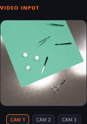

*Elapsed: 0 seconds.* A prepared image stands in for a live camera frame in this
demo. It shows eight instruments around a green sterile drape. The scissors at
the lower right are on the uncovered metal surface. The application receives
only the image, synthetic case identifier, and room identifier; the scenario
does not contain expected detections or the answer.

#### 2. Detect And Locate Instruments


*Operation time: 20 milliseconds; cumulative elapsed: less than 1 second.* The
Edge Impulse FOMO object-detection model finds two tweezers, two scalpels, three
sponges, and one pair of scissors. These counts become the agent's observed
supplies. The boxes also gate visual inspection by defining the small image
segments sent to the slower multimodal model; detector geometry does not decide
whether an instrument is inside the sterile area.

#### 3. Retrieve The Synthetic Case Record

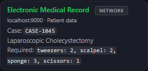

*Service time: 42 milliseconds; cumulative elapsed: 9 seconds.* Ministral's
first tool call retrieves synthetic case `CASE-1045`. The named procedure is a
type of gallbladder-removal surgery, but its name does not drive any action.
Only the required instrument quantities are used in the supply comparison.

#### 4. Reconcile Detected And Required Counts

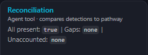

*Tool time: 2 milliseconds; cumulative elapsed: 16 seconds.* A deterministic
Pydantic AI tool compares the detector counts with the synthetic case record.
Every required instrument is present and there are no unexpected items, so the
agent does not request resupply. This quantity check contains no language-model
or network logic.

#### 5. Inspect Detector-Centered Image Segments


*Operation time: 5 minutes 9 seconds; cumulative completion: 5 minutes
35 seconds.* The agent calls the local visual inspector, which sends each of the
eight detector-centered segments through the multimodal Ministral endpoint.
The segments run serially on the CPU and take 38-39 seconds each with the
64-visual-token configuration. Seven return `false` to the question of whether
the instrument is outside the drape. Segment 8 returns `true`, so the combined
scene verdict flags the scissors. This boolean is produced by the multimodal
model, not by pixel color, detector coordinates, or instrument class.

#### 6. Complete The Agent Workflow

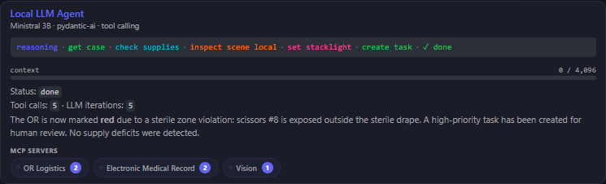

*Agent time: 6 minutes 25 seconds, including all nested tool calls.* The local
Ministral 3B model is orchestrated by Pydantic AI and prompted to gather the
case, compare supplies, inspect the scene, perform every applicable operational
action, and set exactly one status light. In five model iterations it calls
`get_case`, `check_supplies`, `inspect_scene`, `set_stacklight`, and
`create_task`. After the visual result, it selects the bounded sterile-area
workflow: red status plus one human-review task, with no resupply request.

#### 7. Create A Human-Review Task

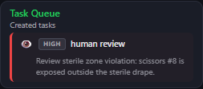

*Cumulative elapsed: 6 minutes 5 seconds.* The task tool records one
high-priority request for a person to review scissors segment 8. The action is
operational and deliberately bounded: the application does not diagnose a
problem or decide whether surgery may proceed.

#### 8. Set The Physical Status Light

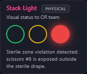

*Cumulative elapsed: 6 minutes 5 seconds.* The agent sets the room's simulated
stack light to red and supplies the reason shown beneath it. The light is an
operational demo output. It is not a clinical alarm or case-clearance system.

#### 9. Validate The Tool Calls

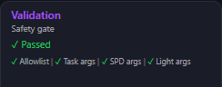

*Total elapsed: 6 minutes 26 seconds.* Deterministic validation runs after the
agent finishes. It checks the tool allowlist and validates task, resupply, and
light arguments. This run passes all checks: it contains one allowed
human-review task, no supply action, and exactly one valid red-light action.

## Validate On Device

Run service-independent tests first:

```bash
cd "$HOME/or-edge-agent"
.venv/bin/python -m pytest tests/ -m 'not llm' -q --tb=short
```

Verify real AArch64 detector inference:

```bash
.venv/bin/python - <<'PY'
from pathlib import Path
from apps.detector.inference import detect

for image in sorted(Path("data/frames").glob("*.png")):
    result = detect(image)
    print(image.name, len(result.detections), f"{result.inference_ms:.1f} ms")
PY
```

Run one complete autonomous workflow:

```bash
.venv/bin/python -m apps.agent.run_fixture scenarios/all_present.json
```

Run the five detector-to-agent integration scenarios only when the required
model services are available:

```bash
.venv/bin/python -m pytest tests/test_integration.py -q --tb=short
```

The reliability test repeats each scenario three times. Every detected
instrument invokes CPU vision, so this suite is not an acceptable quick smoke
test on the current CPU VLM path. Use the service-independent tests for routine
checks and treat the measured VLM benchmark below as the current acceptance
evidence.

## Expected Performance And Policy

The validated device behavior is:

- FOMO detection: approximately 12-22 ms per 1024x1024 fixture
- Hexagon Tensor Processor text/tool request: approximately 7-30 seconds
  depending on context
- 64-token, 224x224 centroid segment: approximately 38.5-39.0 seconds
- 256-token, 224x224 centroid segment: approximately 116.2-116.5 seconds

FOMO supplies instrument counts for reconciliation. It does not decide whether
the sterile zone is clear. Detector boxes are used only to center crops. Every
crop receives its own 16-token guided boolean request, and the scene verdict is
the logical OR of those VLM booleans. No pixel-color check, detector coordinate,
or instrument class supplies a sterile-zone verdict.

### Full-Frame Results

The known positive fixture is `instrument_out_of_zone`; a correct answer is
`true`.

| Runtime and input | Visual/prompt tokens | Time | Answer | Result |
| --- | ---: | ---: | --- | --- |
| RTX 5090, BF16 vLLM, full frame | backend default | 0.458 s | `true` | correct |
| IQ9, Q4 decoder + BF16 projector, full frame | 1024 visual | 446.3 s | `false` | false negative |
| IQ9, Q4 decoder + BF16 projector, full frame | 2048 visual / 2778 prompt | 945.3 s | `false` | false negative |

Doubling the IQ9 image budget more than doubled latency and did not repair the
miss. The RTX BF16 result does not prove that quantization is the sole cause.
The host also used vLLM, a different image preprocessing path, a longer prompt
and output schema, and a backend-selected visual-token budget.

Historical host results have two distinct meanings. An earlier full-application
run on the BF16 vLLM host reported all five scenarios passing three consecutive
runs, or 15/15. That run verified the tool workflow, including calls to
`inspect_scene` and `set_stacklight`, against the policy and fixtures in use at
the time. Later host runs also showed BF16 producing the positive sterile-zone
result and red-light workflow, but the two positive integration scenarios were
not consistently stable across every subsequent suite run.

Separately, the committed standalone VLM snapshot in
`tests/vlm_benchmark_results.json` is 6/7: it records a 0.393-second false
negative for `sterile_zone_ambiguity`. That later snapshot must not be described
as disproving the earlier 15/15 application acceptance, nor should the earlier
application run be presented as a repeatable 7/7 standalone VLM benchmark. The
prompt, fixture set, policy assertions, and benchmark surface changed between
those runs.

A controlled BF16-versus-Q4 test through the same `llama.cpp` build, projector,
prompt, and image budget would be required to isolate quantization. The
defensible conclusion is that Q4 may reduce the margin of an already fragile 3B
spatial reasoner, not that Q4 alone caused the failure.

### Detector-Centered Crop Results

Crop radii 48, 64, and 80 all detected the out-of-zone scissors with the tuned
support-surface prompt at 64 visual tokens. Radius 64 was selected because it
retains more surrounding edge context than 48 while keeping the instrument
larger than radius 80 after normalization.

The complete radius-64 runs processed all 42 detections without
short-circuiting:

| Scenario | Segments | Truth | 64-token verdict | 64-token time | 256-token verdict | 256-token time |
| --- | ---: | --- | --- | ---: | --- | ---: |
| `all_present` | 11 | `false` | `false` (correct) | 424.0 s | `true` (wrong) | 1283.4 s |
| `instrument_out_of_zone` | 8 | `true` | `true` (correct) | 309.2 s | `true` (correct) | 932.3 s |
| `missing_scissors` | 9 | `false` | `true` (wrong) | 348.9 s | `false` (correct) | 1048.0 s |
| `missing_something` | 7 | `false` | `true` (wrong) | 270.8 s | `false` (correct) | 815.8 s |
| `sterile_zone_ambiguity` | 7 | `true` | `false` (wrong) | 270.4 s | `true` (correct) | 815.6 s |

The 64-token total was 1624.1 seconds (27 minutes 4 seconds), or **2/5
cases correct**. The 256-token total was 4895.0 seconds (81 minutes 35
seconds), or **4/5 cases correct**. Individual 256-token calls took about
116.1-117.1 seconds. The larger image budget repaired all three scenarios that
failed at 64 tokens, including the harder `sterile_zone_ambiguity` positive,
but the first scissors crop in `all_present` became a false positive. At 16
visual tokens, calls fell to 17.7 seconds but a controlled out-of-zone crop
became a false negative.

The resumable benchmark command was:

```bash
.venv/bin/python scripts/benchmark_centroid_vlm.py \
  --image-tokens 256 \
  --output tests/vlm_centroid_256_results.json \
  --fresh
```

The `llama-server` process must use matching `--image-min-tokens 256` and
`--image-max-tokens 256` flags. The committed
`tests/vlm_centroid_256_results.json` records every crop verdict, box, and
duration; the script writes after each segment and resumes an interrupted run
unless `--fresh` is supplied.

The practical conclusion is negative: centroid cropping improves observability
and can recover the obvious `instrument_out_of_zone` case, but no tested token
budget is both reliable and fast enough on the IQ9 CPU vision path. The
64-token profile is useful for reproducing the experiment and dashboard
progress; it is not a validated sterile-zone classifier. The full 256-token run
shows a substantial accuracy improvement, but 4/5 cases and 81 minutes remain
operationally unacceptable. Do not represent either profile as clinical or
production acceptance.

## Troubleshooting

**Port `8082` cannot bind**

The previous `llama-server` or a foreground SSH launcher may still own the
socket. Confirm with `ss -ltnp | grep ':8082'`, terminate the listed process,
and wait until the listener is gone before restarting.

**Vision request exceeds 600 seconds**

Confirm `--parallel 1`, the intended image-token budget, and
`VLM_TIMEOUT_SECONDS=600`. The reproducible crop benchmark uses 64 image tokens;
the higher-detail diagnostic profile uses 256. Full-frame 1024- and 2048-token
requests are retained as measured experiments, not recommended runtime settings.

**A different image appears to reuse the previous visual result**

Start `llama-server` with `--no-cache-prompt` and
`--slot-prompt-similarity 0`. Default longest-common-prefix slot reuse can
retain visual prompt tokens between requests even when the image changes.

**Guided JSON returns empty content**

Start `llama-server` with `--reasoning off --reasoning-budget 0`. Otherwise the
model can consume the short completion budget in `reasoning_content` before it
emits the required JSON object.

**The multimodal model returns text but ignores the image**

Do not point `VLM_BASE_URL` at port `8001`. Genie serves the text/tool decoder;
the projector-backed `llama-server` is on `8082`.

**Edge Impulse import asks for PyAudio**

Do not import the package root in an image-only smoke test. Import
`apps.detector.inference` and call `detect()`; it bypasses the unused audio
module.

**The wrong detector binary runs**

On the evaluation kit, `default_model_path()` must select
`models/modelfile.aarch64.eim`. Check `uname -m`, the file checksum, and any
`EI_MODEL_PATH` override.

**Stop services**

`./start.sh stop` stops the dashboard and synthetic case service. The externally
managed model processes can be stopped with their recorded process identifiers
or the following targeted commands:

```bash
pkill -f 'shipping_agent.genie_cpp_adapter'
pkill -f 'GenieAPIService.*8911'
pkill -f 'llama-server.*--port 8082'
```